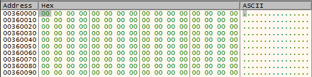
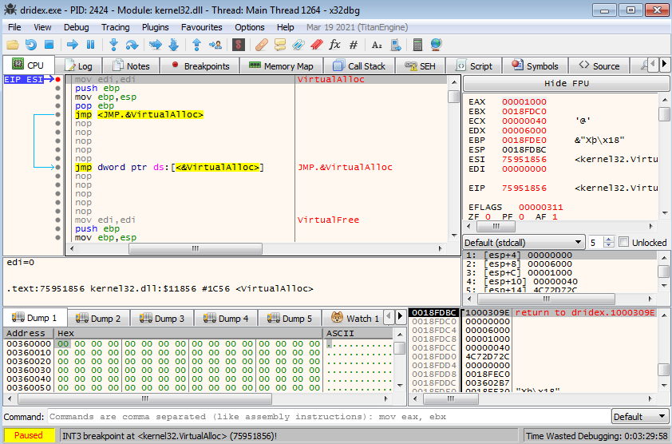
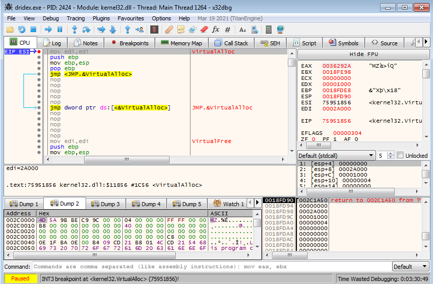
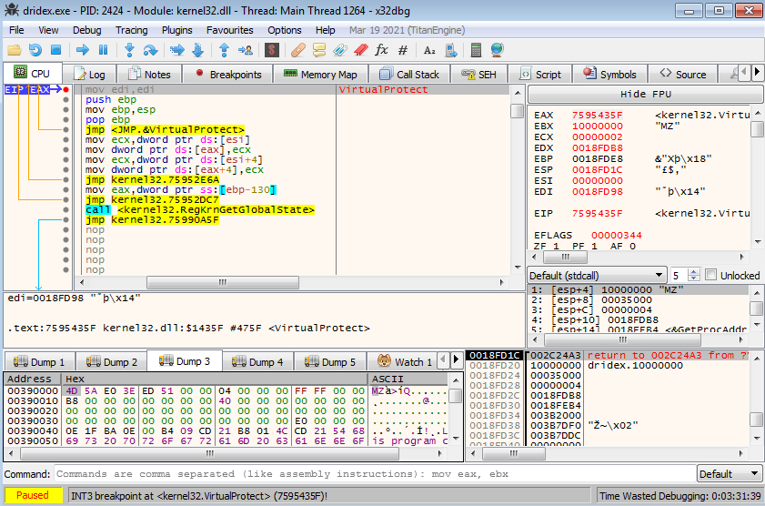
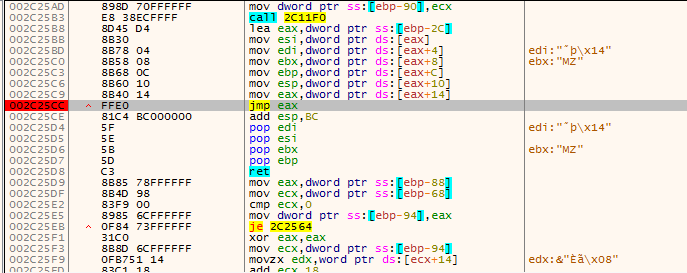

# ./ryodan 
<a href='/'>home</a> 

***
# Malware Unpacking - Dridex
in this article i will explain how to utilize <a href='https://x64dbg.com/'>x32dbg</a> to unpack the famous  DRIDEX malware.

## Dumping Executable
the first step is to load the malware in x32dbg.
 
next we have to insert breakpoint on certain API calls that we use occationaly throghout the process of unpacking modern malware
the API calls are:
1. VirtualAlloc.
2. VirtualProtect.
3. CreateProcessInternalW.
4. IsDebuggerPresent

 
after we set our breakpoints we need to start now running the executable, we run and hit our first breakpoint in VirtualAlloc.

 

now we are in a call to VirtualAlloc function, we suspect that the malware maybe allocating space to write the unpacked executable into that memory space (region) so click run until return and follow the address in EAX (return value from VirtualAlloc).

 
we can clearly see that it's an empty space which is normal (writing happens later).
let's continue stepping, we now hit VirtualAlloc for the second time.

 
again we need to execute until return and also follow the value in EAX in dump, continue execution and once we hit the third VirtualAlloc breakpoint we can see that out second VirtualAlloc allocation has now been filled with an executable.

 
at this point it is a possible choice to dump the PE file we found and check if it is the unpacked malware but to make our work more efficent let's continue our stepping, this time we hit VirtualProtect.

 
VirtualProtect is responsible for changing the permissions of a region in memory and it is likely changing the permissions of the unpacked malware region in memory, so an eazy way to capture the unpacked malware is to start searching (after executing VirtualProtect) for a jump instruction (to a far address or to a register), and indeed afetr executing VirtualAlloc we see a jmp eax instruction, put a breakpoint on the instruction.

 
