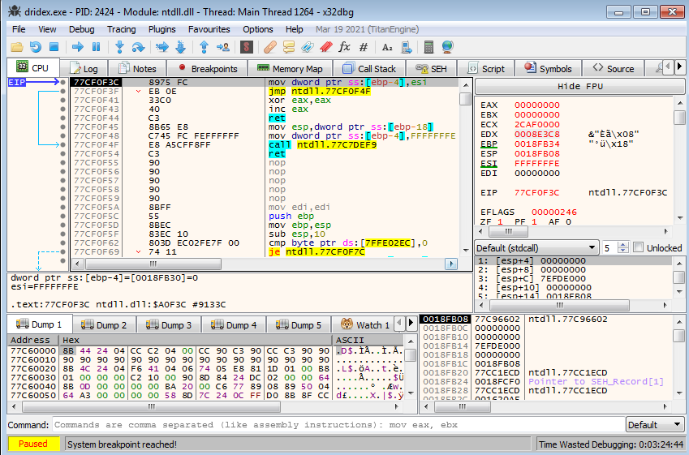
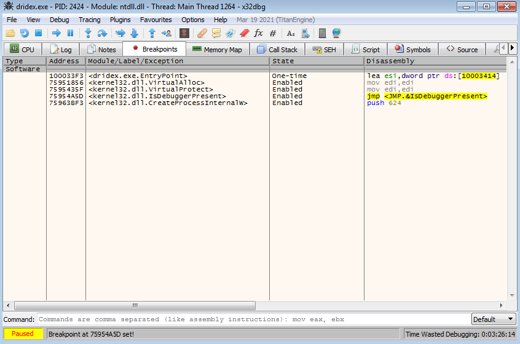
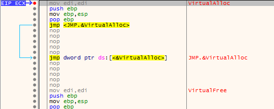

# ./ryodan 
<a href='/'>home</a> 

***
# Malware Unpacking - Dridex
in this article i will explain how to utilize <a href='https://x64dbg.com/'>x32dbg</a> to unpack the famous  DRIDEX malware.

## Dumping Executable
the first step is to load the malware in x32dbg.
 
next we have to insert breakpoint on certain API calls that we use occationaly throghout the process of unpacking modern malware
the API calls are:
1. VirtualAlloc.
2. VirtualProtect.
3. CreateProcessInternalW.
4. IsDebuggerPresent

 
after we set our breakpoints we need to start now running the executable, we run and hit our first breakpoint in VirtualAlloc.

 
