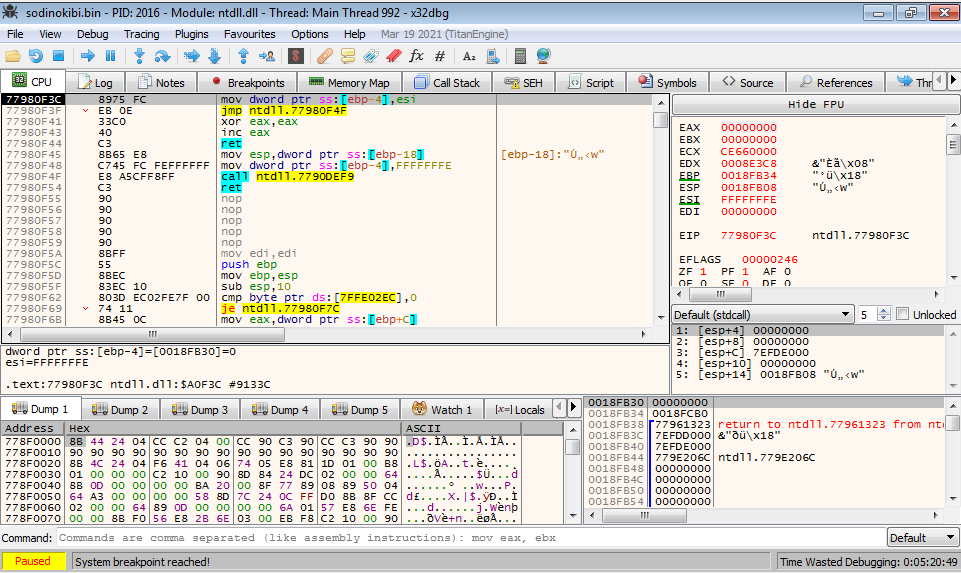

# Unpacking REvil Ransomware sodinokibi.exe
here i'll exaplain how to unpacak the famous REvil Ransomware. 
to download the original sample <a href='sample'>click here</a>. 
*** 
we start first by loading the sample in exeinfo and it is showing that it is packed with an unknown packer. 
 
we have multiple choices to manually unpack the sample but i'll be choosing x32dbg to unpack it, so fire up x32dbg and load the sample. 
 
at this point we dont know anything about the unpacking process or how it is implemented, one choice to use is to look for possible memory allocations and follow the addresses and you might get the unpacked version gets extracted in the memory region 
to do this we have to look for VirtualAlloc API and follow the addresses returned in eax.
