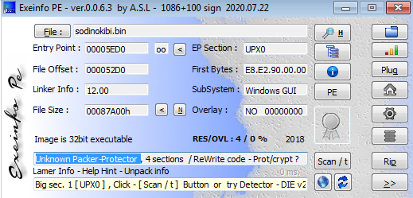

# REvil Ransomware 0x01 - Unpacking
Here i'll explain how to unpack the famous REvil Ransomware sodinokibi.exe. 
to download the original sample <a href='https://app.any.run/tasks/e163502e-3334-46d9-aeb7-e5c925b64af7/'>click here</a>. 

## Identifying Packing  
We start first by loading the sample in <a href='http://www.exeinfo.byethost18.com/'>exeinfo</a> and it is showing that it is packed with an unknown packer.

 

We have multiple choices to manually unpack the sample but I'll be choosing <a href='https://x64dbg.com/'>x32dbg</a> to unpack it, so fire up x32dbg and load the sample.

 

At this point, we don't know anything about the unpacking process or how it is implemented, one choice to use is to look for possible memory allocations and follow the addresses, you might get the unpacked version gets extracted inside the memory region 
to do this we have to look for VirtualAlloc API and follow the addresses returned in eax.

## Dumping Executable
Press Ctrl + G and type VirtualAlloc and follow the jumps until you reach a call to the API, once you find it put a breakpoint and run until the breakpoint is hit.
  
Now you have to make a single step forward and follow the value of eax in dump
  

  
As we can see its an empty space of memory but it is likely to be filled later with some content, usually malware authors tend to use VirtualProtect a lot to change the protections on a piece of data in the virtual memory, it is an important API to put a breakpoint on too

Put a breakpoint with bp VirtualProtect and run the executable, once you hit the breakpoint look to the empty region that was allocated before, you should see a PE file extracted in that region, and that's the unpacked executable.

To dump the executable right click on the address in dump and select follow in memory map then right click on the section and select dump memory to file.

Until now we have an unpacked version of the malware but still we have no imports resolved.

## Resolving IAT
In this malware specifically, the imports are dynamically resolved at run time, it is calling a function at the beginning of execution and when analyzing that functions you'll notice that it is looping through hardcoded values which likely are the imports addresses

to fix the imports a good choice is to dump the executable at run time after it resolves the imports.
> 
note that until now we are just assuming that the function is responsible for the import resolving

to clear our doubts we have to get back to x32dbg and set a breakpoint on the function, then single step forward

notice that API names are now clear to us what means that the imports were resolved successfully, the next step is to dump it using <a href='https://github.com/NtQuery/Scylla'>Scylla</a> plugin.
click plugins and choose Scylla then dump the executable, click -> IAT Autosearch -> Get Imports -> Fix Dump.

to make sure everything is OK review the imports in pestudio.

Great! we successufully unpacked the malware.

<iframe src="https://vlipsy.com/embed/tVmiYVBz" width="640" height="360" frameborder="0"></iframe>
